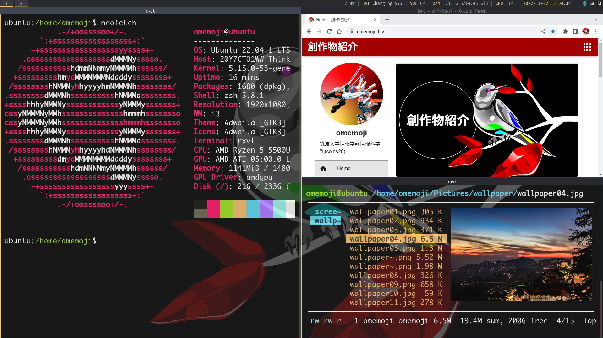

# Ubuntu-i3



A i3-wm-based desktop environment on Ubuntu Server 22.04.

## Usage

1. [Get and install Ubuntu Server 22.04 on your computer](https://ubuntu.com/download/server)

2. Run `install.sh`

```
git clone https://github.com/omemoji/ubuntu-i3.git
cd ubuntu-i3
sh install.sh
```

### 3: Done!🎉

Reboot and enjoy Ubuntu-i3! Of course, you can install other applications you like manually.

Ubuntu-i3 doesn't have a display manager and a desktop environment starts with `startx` (it automatically starts by .zprofile.) If you want a display manager, (for example) you can install LightDM.
```
sudo apt install --no-install-recommends lightdm lightdm-gtk-greeter lightdm-gtk-greeter-settings policykit-1
```

## Environment

### Applications

| Category               | Application        |
| ---------------------- | ------------------ |
| Window manager         | i3                 |
| Launcher               | i3-dmenu-desktop   |
| Input method(Japanese) | Fcitx5 and Mozc    |
| Sound                  | PipeWire(AAC codec)|
| Terminal               | rxvt-unicode       |
| Browser                | Google Chrome      |
| Mailer                 | Thunderbird        |
| Editor                 | Visual Studio Code |
| File manager           | Thunar             |
| Image viewer           | Ristoretto         |
| PDF viewer             | Evince             |
| Media player           | VLC                |
| Image editor           | GIMP, Inkscape     |

| Category     | Application(CUI) |
| ------------ | ---------------- |
| Shell        | zsh              |
| Browser      | w3m              |
| Editor       | Vim, Neovim      |
| File Manager | Ranger           |
